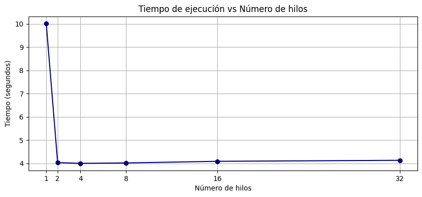
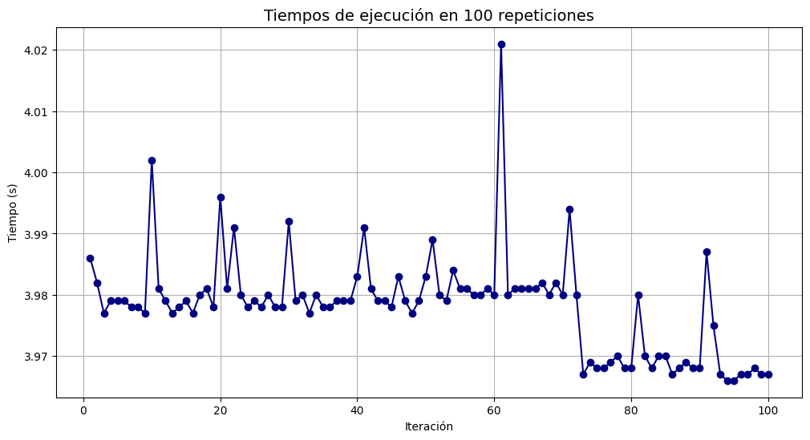
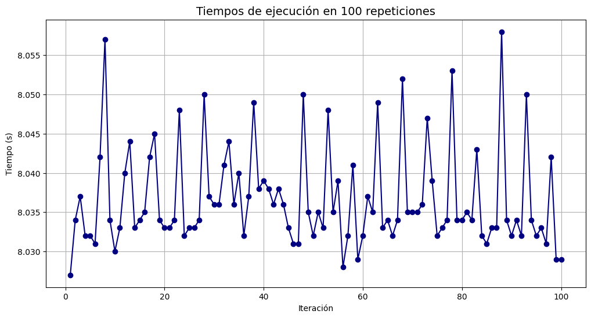
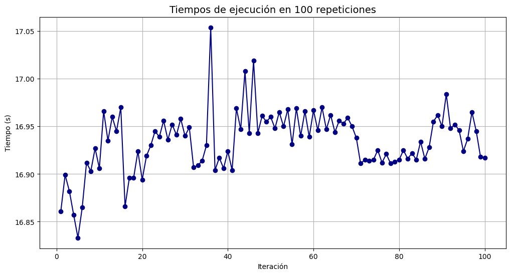

# **Parallelizing in C the library `Counter` from python**

This is the final project for the High Performance Computing course at the [<ins>Escuela Nacional de Estudios Superiores UNAM campus Morelia </ins>](https://www.enesmorelia.unam.mx).

---

## Author and contact
Carlos Daniel Camilo Aguilar | camilodani065@gmail.com

## License
This project is licensed under the MIT License. Please refer to the LICENSE document for more details regarding referencing and usage of this project.

---

## **Introduction**  
In **Python**, the `Counter` class from the `collections` module allows for efficient element counting:
```python
from collections import Counter  
text = ["banana", "apple", "orange"] 
count = Counter(texto)  
print(count)  
# Output: Counter({'banana': 1, 'apple': 1, 'orange': 1})
```   
However, its execution is sequential, which can be a limitation when processing large amounts of data.

This project explores how to parallelize Counter using OpenMP in C. A version was developed that splits a single text into chunks processed in parallel using threads.

---

## **Justification**  
Element counting is a common task in data processing, but when dealing with large datasets, a sequential solution can be inefficient.

• **Problem:** Python’s Counter does not scale well with large datasets.
• **Solution:** Use OpenMP to divide the work among multiple threads and merge the results efficiently.

---

## **General Objective**  
Implement a parallelized version of Python’s Counter in C using OpenMP, distributing a single dataset across threads to improve efficiency in processing large volumes of data using shared-memory parallelism.

---

## **Particular Objectives**  
• Read a single input file and split its content among multiple threads.

• Perform local counting of elements in parallel using OpenMP.

• Merge local counting results into a global result efficiently.

• Compare the performance of the parallel implementation against Python’s Counter with large inputs.

## **Results**

### Execution time vs. Number of threads


### Comparison with Small (256 mb), Medium (512 mb), and Large (1024 mb) Inputs

| Input Size | Python `Counter` | OpenMP Counter (C) |
|------------|------------------|--------------------|
| Small      |  |  |
| Medium     |  |  |
| Large      |  |  |

## **Bibliography**
[OpenMP](https://www.openmp.org/)

[uthash](https://github.com/troydhanson/uthash)

[Documentation](https://learn.microsoft.com/es-es/cpp/parallel/openmp/reference/openmp-directives?view=msvc-170)
